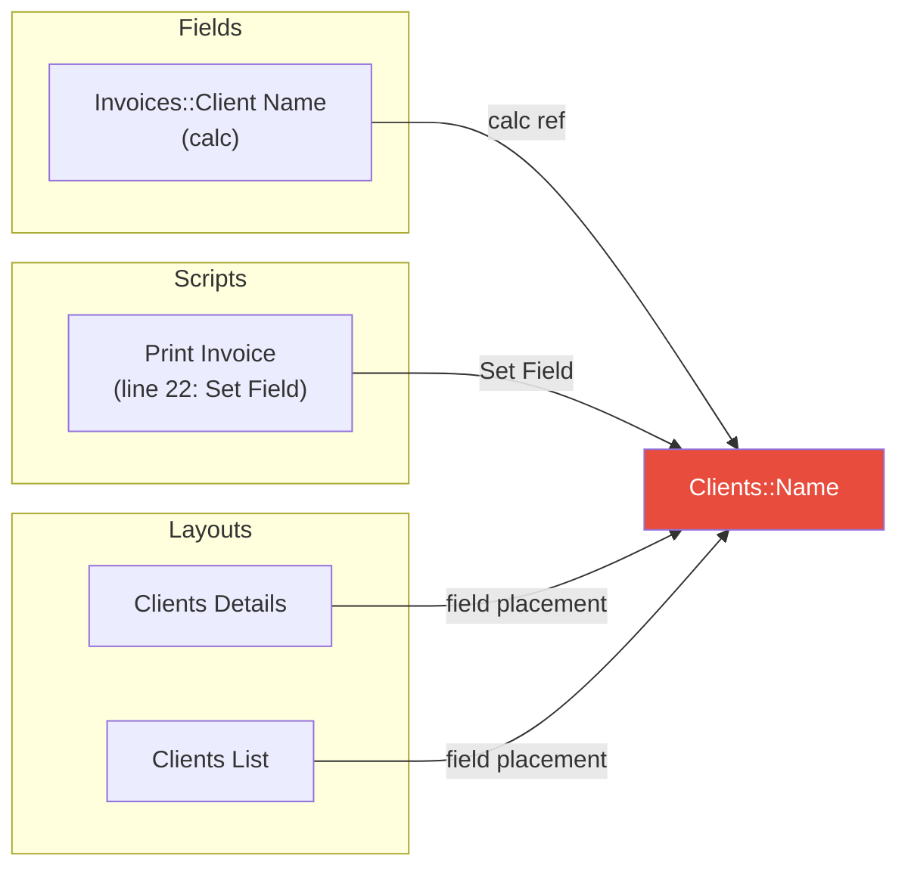
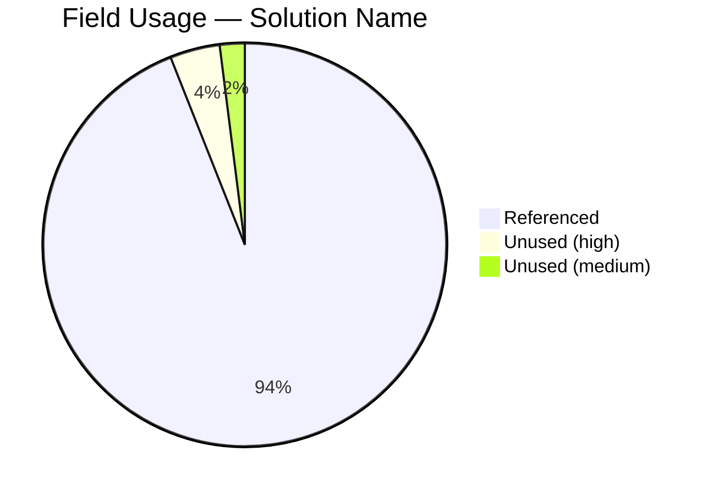

# Trace — Cross-Reference Tracer

Traces references to FileMaker objects (fields, scripts, custom functions, layouts, value lists) across an entire solution. It combines the plugin's **discovery system** for fast, exhaustive scanning with **agentic correlation** for edge cases that require judgment.

## Architecture

### Layer 1: Discovery system (the plugin)

The plugin indexes a full SaXML export of the solution and answers cross-reference queries against it. Load it once per session:

```bash
python3 agent/scripts/agfm_bridge.py save-as-xml --load
```

This drives FileMaker (it triggers a Save a Copy as XML through `AGFM_Bridge`), so **pause for the developer's go-ahead before running it**. Check whether it's already loaded first — `agfm_bridge.py status` reports the discovery state, or `GET /api/discovery/status` returns `hasData`.

Relevant query types:

| Query | Purpose |
|---|---|
| `references` | What references this entity (inbound — the usage report) |
| `dependencies` | What this entity references (outbound) |
| `impact` | Blast-radius analysis with built-in severity classification |
| `orphans` | Unreferenced fields, scripts, and custom functions |
| `broken` | References that no longer resolve |
| `text_search` | Free-text across all entity names and bodies |
| `indirection` | Indirect calls — ExecuteSQL, variable script names |

```bash
python3 agent/scripts/agfm_bridge.py discovery-query references --script "My Script"
python3 agent/scripts/agfm_bridge.py discovery-query text_search --text "Clients::Name"
python3 agent/scripts/agfm_bridge.py discovery-query orphans
python3 agent/scripts/agfm_bridge.py discovery-query indirection
```

For entity types other than scripts, use the body form so you can pass `type` and `name`:

```bash
curl -s -X POST -H "Authorization: Bearer $AGFM_PLUGIN_TOKEN" \
  -H "Content-Type: application/json" \
  -d '{"query": "references", "type": "field", "name": "Clients::Name"}' \
  "http://localhost:${AGFM_PLUGIN_PORT:-8766}/api/discovery/query"
```

### Layer 2: Agentic correlation (this skill)

Adds judgment for things static analysis cannot handle: ExecuteSQL string contents, dynamic references, ambiguity resolution, severity nuance, and false positive filtering.

---

## Workflow

### Step 1 — Preflight

```bash
python3 agent/scripts/agfm_bridge.py status
```

This confirms the plugin is reachable and reports whether discovery is loaded.

- **Plugin unreachable** → say so and stop. There is no local index to fall back on.
- **Discovery not loaded** → ask for a go-ahead, then run `agfm_bridge.py save-as-xml --load`.
- **Discovery loaded** → proceed directly. Only reload if the developer says the schema changed, or if results look stale.

Also confirm the loaded solution matches what the developer is asking about — `GET /api/discovery/solution` lists the loaded files.

### Step 2 — Infer mode from the developer's request

| Request pattern | Mode | Query |
|----------------|------|-------|
| "Where is X used?" / "Find references to X" / "Trace X" | **Usage** | `references` |
| "What breaks if I rename X?" / "Impact of changing X" | **Impact** | `impact` + agentic severity review |
| "Show unused fields" / "Dead code" / "Unused scripts" | **Dead** | `orphans` |
| "What does X reference?" / "Dependencies of X" | **Outbound** | `dependencies` |

### Step 3 — Run the query plus the agentic passes (parallel)

The discovery query and the agentic scans are independent — run them in the same parallel batch.

#### Usage / Impact mode — parallel batch:

```bash
# 3a. The primary discovery query
python3 agent/scripts/agfm_bridge.py discovery-query references --script "{name}"

# 3b. Indirect and dynamic references (ExecuteSQL, variable script names)
python3 agent/scripts/agfm_bridge.py discovery-query indirection

# 3c. Free-text sweep — catches string-literal mentions static analysis misses
python3 agent/scripts/agfm_bridge.py discovery-query text_search --text "{name}"
```

Skip 3b/3c when they aren't relevant to the object type (e.g. skip the indirection scan when tracing a layout).

#### Dead mode:

```bash
python3 agent/scripts/agfm_bridge.py discovery-query orphans
```

Pair with `discovery-query broken` to catch references pointing at objects that no longer exist.

### Step 4 — Agentic correlation

Analyze the Step 3 results. This is pure analysis — no additional tool calls unless a specific script body needs closer reading.

#### a. ExecuteSQL string analysis

From the `indirection` and `text_search` results, for each script containing `ExecuteSQL`:
- Pull just that script's body (`discovery-query script_body`) if you need more context
- SQL uses **raw table names** (not TOs) and may differ from FM field names
- SQL strings may be built via concatenation or variables
- Flag as "dynamic reference — may be affected" with an explanation

#### b. Dynamic references

Flag any step using:
- **GetField()** / **GetFieldName()** — field names as strings or variables
- **Evaluate()** — arbitrary calculation evaluated at runtime
- **Perform Script by Name** — script name from a variable

Note the variable source so the developer can trace it manually. These cannot be resolved statically.

#### c. Ambiguity resolution

When the same field name exists in multiple tables (e.g. `Status` in `Clients`, `Invoices`, and `Products`), unqualified references in calcs are ambiguous. Use layout and TO context to disambiguate where possible.

#### d. Impact severity classification (impact mode only)

`discovery-query impact` returns its own severity classification. Review it rather than taking it at face value:

| Severity | Meaning | Examples |
|----------|---------|----------|
| **BREAK** | Direct reference that will error | Set Field, Set Variable, If condition referencing the renamed object |
| **WARN** | Indirect reference that may fail | ExecuteSQL string literal, GetField with a concatenated name |
| **INFO** | FM auto-updates on rename | Layout field placements, relationship graph join fields |

Promote anything the agentic passes surfaced that discovery classified as INFO or missed entirely.

#### e. False positive filtering (dead mode only)

Review orphan results and filter:
- Fields whose only auto-enter references `Self` (active even with no external refs)
- Scripts likely triggered by buttons or script triggers — cross-check `discovery-query triggers` and `layout_objects`
- Custom functions used only by other custom functions — trace the chain to see if it leads to active code
- Fields that serve as UI display only (on a layout, not in scripts) — flag as medium confidence, not truly dead

### Step 5 — Present the report

Format the combined results appropriately to the mode:

**Usage mode**: Group by source type (field calcs, scripts, layouts, relationships) with counts.

**Impact mode**: Group by severity (BREAK, WARN, INFO) with specific locations and explanations.

**Dead mode**: Group by confidence (HIGH, MEDIUM, LOW) with counts and a summary.

### Step 5b — Diagram (optional)

Offer a visual when the reference graph is large enough to benefit:

> Would you like a diagram of these references?

If yes, generate a Mermaid diagram and push it to the plugin's preview surface, which renders it in the agfm Web Viewer inside FileMaker:

#### Usage/Impact mode — Flowchart

Generate a `flowchart LR` centered on the target object, with subgraphs grouping referencing objects by type. For impact mode, color nodes by severity (red = BREAK, yellow = WARN, green = INFO).



#### Dead mode — Pie chart



#### Push the diagram

```bash
curl -s -X POST -H "Authorization: Bearer $AGFM_PLUGIN_TOKEN" \
  -H "Content-Type: application/json" \
  -d '{"type": "mermaid", "content": "<mermaid source>"}' \
  "http://localhost:${AGFM_PLUGIN_PORT:-8766}/api/preview"
```

---

## Tool call budget

Target tool calls from invocation to results presented:

| Mode | Discovery not loaded | Discovery already loaded |
|------|----------------------|--------------------------|
| Usage | 3 (status, load, query+scans) | 2 (status, query+scans) |
| Dead | 3 (status, load, orphans+broken) | 2 (status, orphans+broken) |
| Impact | 4 (status, load, queries+scans, body reads) | 3 (status, queries+scans, body reads) |

The key savings come from: (1) not reloading discovery when it's already in memory, (2) running the discovery query and the agentic scans in the same parallel batch, (3) only pulling individual script bodies when a specific one needs closer reading.

---

## Examples

### Example 1 — Usage report

Developer: "Where is `Clients::Name` used?"

1. `agfm_bridge.py status` — discovery already loaded
2. **Parallel batch**: `references` for the field + `indirection` + `text_search --text "Clients::Name"`
3. Correlate: no ExecuteSQL hits reference the Clients table, no dynamic refs
4. Present report: 2 field calcs, 7 layout placements, 0 scripts

**Tool calls: 2**

### Example 2 — Dead object scan

Developer: "Show me all unused fields"

1. `agfm_bridge.py status` — discovery already loaded
2. **Parallel batch**: `orphans` + `broken` + `triggers`
3. Verify: `Invoices::FoundCount` and `Line Items::FoundCount` are unstored calcs for `Get(FoundCount)` — used only at runtime on layouts where the field is placed
4. Cross-check `layout_objects` for those placements; downgrade to medium confidence if present
5. Present report with confidence levels

**Tool calls: 2**

### Example 3 — Impact analysis

Developer: "What breaks if I rename the Clients table to Companies?"

1. `agfm_bridge.py status` — discovery not loaded; ask for a go-ahead, then `save-as-xml --load`
2. **Parallel batch**: `impact` for the table + `indirection` + `text_search --text "Clients"`
3. Pull the matched ExecuteSQL script bodies in parallel to check for raw `Clients` table references
4. Review discovery's severity classification; promote ExecuteSQL string hits from INFO to WARN
5. Present severity-grouped report
6. Offer a flowchart diagram with severity coloring

**Tool calls: 4**
