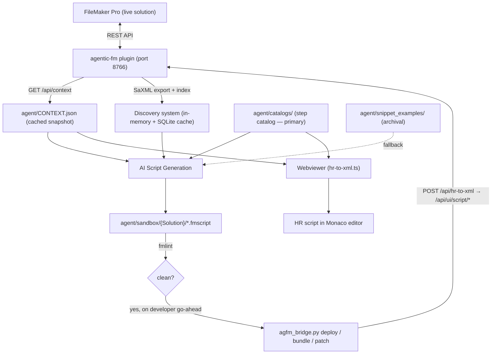

# Architecture

This document describes the architecture of the agentic-fm project -- the data pipeline, the role of each artifact, and the conventions that govern how AI agents interact with FileMaker solution data. It is intended to be read by both humans and AI so that new features can be added with full awareness of how the pieces fit together.

## Pipeline Overview



**The plugin is the only interface to FileMaker.** It runs on the macOS host beside FileMaker Pro and serves a token-authenticated REST API for context, schema queries, clipboard, Script Workspace manipulation, calculation evaluation, and UI automation. There is no AppleScript, companion-server, or offline-export path; when the plugin is unreachable the agent stops rather than degrading to stale data.

Two data sources reach the AI, both served by the plugin:

1. **Live context** (`GET /api/context`) -- scoped to the frontmost file and current layout, providing exactly the tables, fields, relationships, layouts, scripts, and value lists the AI needs, complete with IDs that embed directly into fmxmlsnippet output. Mirrored to `agent/CONTEXT.json` as a cached snapshot with a `generated_at` timestamp (ISO 8601 UTC).
2. **Discovery index** -- a full SaXML export indexed in memory (backed by an on-disk SQLite cache), loaded once per session with `agfm_bridge.py save-as-xml --load`. It answers solution-wide questions — script bodies, references, dependencies, orphans, impact analysis — without touching the Script Workspace.

At generation time two local inputs converge with those:

- **Step catalog** (`agent/catalogs/step-catalog-en.json`) -- the single source of truth for all FileMaker script step XML structure. Provides step IDs, parameter definitions, types, enums, HR signatures, and behavioral notes. Agents grep it before any other source.
- **snippet_examples/** -- archival fmxmlsnippet templates retained for complex step examples not yet fully captured in the catalog. Not the primary lookup source.

The AI produces a human-readable `.fmscript` in `agent/sandbox/{Solution}/`, lints it, and — after the developer signals readiness — deploys it back through the plugin, which converts HR to fmxmlsnippet and writes it into the Script Workspace. The **webviewer** provides a parallel workflow where the same context and step catalog feed a browser-based editor; HR-to-XML conversion happens client-side via `webviewer/src/converter/hr-to-xml.ts`.

## Artifact Inventory

| Artifact             | Location                              | Generated By                   | Purpose                                                       |
| -------------------- | ------------------------------------- | ------------------------------ | ------------------------------------------------------------- |
| Plugin bridge        | `agent/scripts/agfm_bridge.py`        | Manual (checked in)            | The single CLI interface to the plugin — context, query, lint, deploy, clipboard, discovery |
| Live context         | `GET /api/context`                    | agentic-fm plugin              | Authoritative scoped context for the current file and layout  |
| CONTEXT.json         | `agent/CONTEXT.json`                  | agentic-fm plugin              | On-disk cache of the live context; includes `generated_at` timestamp |
| CONTEXT.example.json | `agent/CONTEXT.example.json`          | Manual (checked in)            | Schema reference and realistic example                        |
| Discovery index      | Plugin memory + SQLite cache          | `agfm_bridge.py save-as-xml --load` | Solution-wide cross-reference: script bodies, references, dependencies, orphans, impact |
| Snippet examples     | `agent/snippet_examples/`             | Manual (checked in)            | Archival fmxmlsnippet templates; fallback when catalog entry is insufficient |
| Step catalog         | `agent/catalogs/step-catalog-en.json` | Manual (checked in)            | Single source of truth for all script steps -- IDs, params, types, enums, HR signatures, behavioral notes |
| Webviewer            | `webviewer/`                          | Manual (checked in)            | Browser-based visual script editor with live HR-to-XML conversion and AI chat |
| Generated scripts    | `agent/sandbox/{Solution}/`           | AI agent                       | Human-readable `.fmscript` output, one subfolder per solution  |
| Linter               | `agent/fmlint/`                       | Manual (checked in)            | Structural, naming, reference, and calculation validation      |
| Validation script    | `agent/scripts/validate_snippet.py`   | Manual (checked in)            | Post-generation validation of fmxmlsnippet output; checks staleness and coding conventions |

## Context Hierarchy

There is a single authoritative source — the plugin. The hierarchy below is about **cost**, not fallback: each level answers a different class of question, and the cheapest sufficient one wins.

```
Level 1 ─ agent/catalogs/step-catalog-en.json   (step structure — no FM round-trip needed)
Level 2 ─ GET /api/context                      (current file + layout, ~2-5 KB)
Level 3 ─ POST /api/query                       (arbitrary SQL against FM system tables)
Level 4 ─ Discovery queries                     (solution-wide cross-reference; needs one-time load)
```

1. **Step catalog** -- Answer structural questions locally. Never costs a FileMaker round-trip.
2. **`/api/context`** -- Read first for anything solution-specific. Contains everything needed for the current task with IDs ready to use.
3. **`/api/query`** -- When an object is outside the current layout's scope, query `FileMaker_Tables` / `FileMaker_Fields` directly. Asynchronous: poll `/api/eval/:id` until `complete: true`.
4. **Discovery** -- For cross-solution questions (who calls this, what breaks if I rename it, what's unused). Requires `save-as-xml --load` once per session.

If the plugin is unreachable, none of levels 2-4 are available. Stop and tell the developer — do not guess at IDs or work from a stale `CONTEXT.json`.

## CONTEXT.json Schema

`CONTEXT.json` is an on-disk cache of `GET /api/context`, written by the plugin and scoped to the frontmost file and current layout. Prefer a live fetch; the file exists so context survives between calls.

Top-level keys:

| Key                | Type   | Description                                                                         |
| ------------------ | ------ | ----------------------------------------------------------------------------------- |
| `solution`         | String | FileMaker file name                                                                 |
| `task`             | String | Natural-language description of what to create                                      |
| `generated_at`     | String | ISO 8601 UTC timestamp of when the context was generated; used for staleness detection (>60 min triggers a warning in validate_snippet.py). Refresh with `POST /api/context/refresh` |
| `current_layout`   | Object | `name`, `id`, `base_to`, `base_to_id`                                               |
| `tables`           | Object | Keyed by base table name; each entry has `id`, `to`, `to_id`, and a `fields` object |
| `ddl`              | String | SQL DDL with FOREIGN KEY constraints and field comments                             |
| `relationships`    | Array  | Join definitions: TOs, join type, join fields, cascade settings                     |
| `scripts`          | Object | Scripts the AI may call: `{ "name": { "id": N } }`                                  |
| `layouts`          | Object | Layouts the AI may navigate to: `{ "name": { "id": N, "base_to": "..." } }`         |
| `value_lists`      | Object | Value lists: `{ "name": { "id": N, "values": [...] } }`                             |
| `layout_objects`   | Array  | Named objects on the current layout (for `Go to Object[]`)                          |
| `custom_functions` | Object | _(optional)_ Custom functions available in the solution                             |

See `agent/CONTEXT.example.json` for a complete, realistic example.

## Step Catalog

`agent/catalogs/step-catalog-en.json` is the canonical structured reference for all FileMaker script steps. It sits between CONTEXT.json (which provides solution-specific IDs) and snippet_examples (which provide complex XML templates). For the majority of steps, the catalog alone is sufficient to construct correct fmxmlsnippet XML.

Each catalog entry provides:

| Field            | Purpose                                                                           |
| ---------------- | --------------------------------------------------------------------------------- |
| `id`             | FileMaker internal step ID -- use in `<Step id="X">`                              |
| `selfClosing`    | `true` = `<Step ... />`, `false` = `<Step ...>...</Step>`                         |
| `params[]`       | Full parameter spec: `xmlElement`, `type`, `hrLabel`, `wrapperElement`, `xmlAttr`, `required`, `defaultValue`, `enumValues` |
| `hrSignature`    | Human-readable parameter format for HR output                                     |
| `monacoSnippet`  | VS Code / Monaco snippet for autocomplete                                         |
| `blockPair`      | Matching step partners and role (`open`/`middle`/`close`)                         |
| `notes`          | Behavioral context with sub-keys: `constraints`, `platform`, `gotchas`, `performance`, `behavioral` |
| `snippetFile`    | Path to the corresponding snippet_examples file (fallback reference)              |
| `status`         | `"complete"` = fully reviewed, `"auto"` = unreviewed, `"unfinished"` = partial    |

Consumers: CLI/IDE agents (grep for step structure), webviewer (HR-to-XML converter and Monaco autocomplete), and `validate_snippet.py` (step name validation).

## Interaction Modes

The toolchain supports three interaction modes. All share the same `agent/` folder, plugin connection, and step catalog.

| Aspect           | CLI (e.g. Claude Code)               | IDE (e.g. Cursor, VS Code)           | Webviewer                                     |
| ---------------- | ------------------------------------ | ------------------------------------ | --------------------------------------------- |
| Interface        | Terminal                             | Editor with AI pane                  | Browser (standalone or embedded in FileMaker) |
| Output format    | `.fmscript` in `agent/sandbox/`      | `.fmscript` in `agent/sandbox/`      | HR script in Monaco editor                    |
| XML generation   | Plugin `/api/hr-to-xml` at deploy    | Plugin `/api/hr-to-xml` at deploy    | Client-side `hr-to-xml.ts` converter          |
| Delivery         | `agfm_bridge.py deploy/bundle/patch` | `agfm_bridge.py deploy/bundle/patch` | Plugin clipboard write                        |
| AI provider      | Model behind the CLI/IDE             | Model behind the CLI/IDE             | Anthropic API, OpenAI API, or Claude Code CLI |

The webviewer is a Preact + Monaco + Vite application in `webviewer/`. Its three-panel layout provides a Monaco script editor, live XML preview, and integrated AI chat. It can run as a standalone browser app or embedded inside a FileMaker WebViewer object. See `webviewer/WEBVIEWER_INTEGRATION.md` for full details.

## Script Generation Workflow

The AI follows a mandatory sequence when generating script output:

1. **Fetch live context** (`GET /api/context`, or `agfm_bridge.py context`) -- understand the task and collect all reference IDs. Verify the solution and layout match what the developer asked for.
2. **Grep the step catalog** (`agent/catalogs/step-catalog-en.json`) for each step type being generated. The catalog is the single source of truth — behavioral notes from snippet_examples have been migrated into the catalog's `notes` field. For steps with `"status": "complete"`, construct XML directly from the catalog's `params` array. Fall back to reading the corresponding `agent/snippet_examples/` file only for archival reference when the catalog entry is insufficient.
3. **Substitute IDs and names** from the context into the step structure.
4. If a reference is outside the current layout's scope, resolve it via `POST /api/query` or a discovery query. If the plugin is unreachable, stop and tell the developer.
5. Write the resulting human-readable script to `agent/sandbox/{Solution}/<Name>.fmscript`.
6. Run `agfm_bridge.py lint` and fix all ERROR-severity diagnostics before presenting the work.
7. **Pause for the developer's go-ahead** before any FileMaker-touching operation — they may be mid-edit. Then deploy via `agfm_bridge.py deploy` / `bundle` / `patch`.

Output rules:

- Scripts are authored as human-readable `.fmscript`; the plugin converts to fmxmlsnippet at deploy time via `/api/hr-to-xml`.
- Generated fmxmlsnippet is wrapped in `<fmxmlsnippet type="FMObjectList">` and contains **script steps only** -- never wrapped in `<Script>` tags.
- Step structures must match the step catalog or snippet_examples; never invent or guess XML structure.
- Paired steps (e.g. `If` / `End If`, `Open Transaction` / `Commit Transaction`) must always appear together.
- Never use XML comments (`<!-- -->`) — FileMaker silently discards them on paste. Use `#` comment steps instead.
- In the webviewer context, output HR format -- the client-side converter handles the translation.

## CLI Tools

### agfm_bridge.py

The single interface to the plugin, and therefore to FileMaker. All FM-touching operations go through it.

```
python3 agent/scripts/agfm_bridge.py status                      # health check + discovery state
python3 agent/scripts/agfm_bridge.py context                     # fetch and cache live context
python3 agent/scripts/agfm_bridge.py query "SELECT ..."          # SQL against FM system tables
python3 agent/scripts/agfm_bridge.py lint <file>                 # FMLint (plugin, local fallback)
python3 agent/scripts/agfm_bridge.py deploy <file> "Script"      # replace an existing script
python3 agent/scripts/agfm_bridge.py bundle <file> --names "..." # create a new script
python3 agent/scripts/agfm_bridge.py patch <patch.json>          # surgical step edits
python3 agent/scripts/agfm_bridge.py save-as-xml --load          # export SaXML + load discovery
python3 agent/scripts/agfm_bridge.py discovery-query <type> ...  # cross-reference queries
python3 agent/scripts/agfm_bridge.py bridge-upgrade              # install/update AGFM_Bridge in FM
```

- Resolves the plugin URL from `AGFM_PLUGIN_URL`, else `AGFM_PLUGIN_PORT` (default 8766), using the right host for the environment (`host.docker.internal` inside a container).
- Authenticates with `AGFM_PLUGIN_TOKEN` from `.env.local`.
- Detects `.fmscript` input and converts HR to fmxmlsnippet automatically before deploying.
- Full endpoint reference: `agent/docs/PLUGIN.md`.

### validate_snippet.py

Validates fmxmlsnippet output in `agent/sandbox/` for common errors before pasting into FileMaker.

```
python3 agent/scripts/validate_snippet.py [file_or_directory] [options]
```

- Defaults to validating all files in `agent/sandbox/`.
- Auto-detects `agent/CONTEXT.json` for reference cross-checking.
- Checks: well-formed XML, correct root element, no `<Script>` wrapper, required step attributes, paired step balancing (If/End If, Loop/End Loop, Open Transaction/Commit Transaction), Else/Else If ordering, known step names (against snippet_examples), field/layout/script ID cross-references against CONTEXT.json, context staleness (warns if `generated_at` is older than 60 minutes), and coding convention violations (ASCII comparison operators, variable naming prefix violations).
- Use `--context <path>` to specify an alternate CONTEXT.json, `--snippets <path>` for a custom snippet_examples directory, or `--quiet` for errors-only output.
- Exit code 0 = all files passed, 1 = one or more files failed.

### Context() custom function

A FileMaker custom function (`filemaker/Context.fmfn`) that generates the context JSON at runtime inside the FileMaker solution. The plugin evaluates it to serve `GET /api/context`, so it must be installed in every solution you work on.

```
Context ( "Create a script to add a new line item to the current invoice" )
```

- Requires FileMaker Pro 21.0+.
- Evaluates on the current layout and auto-discovers relevant TOs, fields, and relationships.
- See `docs/Context.fmfn.md` for the full technical reference.

### AGFM_Bridge script

The plugin's in-FileMaker counterpart. The plugin dispatches sub-protocol commands to it for operations that must execute inside FileMaker — SaXML export, window open, webview control, file open.

```
python3 agent/scripts/agfm_bridge.py bridge-upgrade
```

- Install or update in one command; the plugin drives the paste via AX automation.
- `GET /api/bridge/status` returns the detected version and the full sub-protocol command catalog.

## Adding New Features

When extending this project, keep the following principles in mind:

1. **The plugin is the only path to FileMaker.** Do not add AppleScript, `osascript`, companion-server, or local-export fallbacks. If a capability is missing, add a plugin endpoint (and document it in `agent/docs/PLUGIN.md`) rather than routing around the plugin. When the plugin cannot do something, `GET /api/capability-gaps` is the honest answer — surface it to the developer.

2. **Keep responses lean.** Plugin responses and discovery queries exist to reduce token consumption. Return signal -- names, IDs, types, and references. Discard UUIDs, hashes, timestamps, and visual positioning data.

3. **Route new commands through `agfm_bridge.py`.** New FM operations become subcommands there rather than standalone scripts, so URL resolution, auth, and error handling stay in one place.

4. **Update documentation together.** When adding a new artifact or changing the pipeline:
   - Update this file (`ARCHITECTURE.md`) with the new artifact and its role.
   - Update `.cursor/AGENTS.md` so the AI knows how to use the new artifact.
   - Update `README.md` if the change affects end-user workflow or project structure.

5. **The step catalog is the single source of truth for step structure.** `agent/catalogs/step-catalog-en.json` is the definitive reference for step XML structure, parameter definitions, enums, and behavioral notes. `snippet_examples/` is archival — it serves as a fallback only for complex steps with `"auto"`/`"unfinished"` catalog status or where the catalog entry remains insufficient. If you add support for a new script step type, add its catalog entry (including behavioral notes in the `notes` field) and a corresponding snippet_examples template for reference. All snippet files must follow the conventions in `agent/snippet_examples/steps/CONVENTIONS.md`.

6. **CONTEXT.json is generated, not authored.** Changes to the context schema require updating the `Context()` custom function in FileMaker (`filemaker/Context.fmfn`), not just the example file. The `agent/CONTEXT.example.json` file and `docs/Context.fmfn.md` should be updated to reflect any schema changes.

7. **Pause before touching FileMaker.** The developer may be actively working in the file. Any FM-touching operation — deploy, bridge upgrade, SaXML export, AX automation — waits for an explicit go-ahead. Build this into any new command that reaches into FileMaker.

8. **Webviewer changes require converter parity.** If you modify the step catalog or add new step types, verify that the webviewer's HR-to-XML converter (`webviewer/src/converter/hr-to-xml.ts`) handles the changes correctly. The converter must stay in sync with the catalog.

## Dependencies

| Dependency          | Required By                                                | Notes                                                                            |
| ------------------- | ---------------------------------------------------------- | -------------------------------------------------------------------------------- |
| agentic-fm plugin   | Everything that touches FileMaker                          | macOS host; `AGFM_PLUGIN_TOKEN` in `.env.local`, port 8766 by default            |
| FileMaker Pro 21.0+ | `Context()` function, `AGFM_Bridge`                        | For `GetTableDDL` and `While` support                                            |
| Python 3 (stdlib)   | `agfm_bridge.py`, `validate_snippet.py`, `agent/fmlint/`   | No virtualenv required; run directly with `python3 agent/scripts/...`            |
| Node.js 18+         | `webviewer/`                                               | For Vite dev server and build                                                    |
